# Hangman

## Introduction

Welcome to the Hangman Game Project! This classic word-guessing game has entertained players for generations, blending strategy, vocabulary, and a dash of suspense. The objective is simple: guess the hidden word by suggesting letters within a limited number of attempts. Each incorrect guess brings the player closer to losing, while each correct letter gradually reveals the mystery word.

In this project, we are implementing a digital version of Hangman where both human players and the computer can participate. Players can compete against the computer, which will randomly select words and make guesses, adding an exciting twist to the traditional gameplay. Additionally, users can challenge themselves against different difficulty levels and a diverse word bank, enhancing the educational value of the game.

This documentation will guide you through the development process, detailing the game's design, features, and technical specifications. Join us as we explore the world of Hangman and create a memorable gaming experience for everyone involved!

## Installation

Follow these steps to set up the project on your local machine:

### Prerequisites

- Python 3.6 or higher
- Pip (Python package installer)

### Steps

1. **Clone the repository** (if applicable):
   ```bash
   git clone <repository-url>
   cd Hangman
   ```

2. **Create a virtual environment**:
   ```bash
   python -m venv env
   ```

3. **Activate the virtual environment**:
* On Windows:
   ```bash
   .\env\Scripts\activate
   ```
* On macOS/Linux:
    ```bash
    source env/bin/activate
    ```

4. **Create a `.env` file**:
In the root of your project directory, create a file named `.env` and add the following lines, replacing `your_mysql_username` and `your_mysql_password` with your actual MySQL credentials:

    ```makefile
    DB_USER=your_mysql_username
    DB_PASS=your_mysql_password
    ```

5. **Install the required packages** (if applicable):
Run:
   ```bash
   pip install -r requirements.txt
   ```

6. **Run the application** (if applicable):
 After installation, you can start the game with:
   ```bash
   python hangman.py
   ```

# Project Overview

This project aims to develop a digital version of the classic Hangman game using Python, the Tkinter graphical user interface (GUI) toolkit, and a MySQL database.

## Game Modes

We offer two engaging gaming modes:

### 1. Player vs. Computer

In this mode, the user attempts to guess a word randomly selected by the computer. The process is as follows:

- The computer generates a random word from the database.
- The program displays the length of the word using empty spaces for each letter.
- The user is prompted to guess letters that may be present in the word.
- The computer provides feedback on the guesses, filling in the correct letters in their corresponding positions.
- The game tracks the number of attempts remaining.
- Players win by guessing the word within eight attempts; otherwise, they lose.

### 2. Computer vs. User

In this mode, the user thinks of a word, and the program attempts to guess it. Here’s how it works:

- The user selects a word and inputs its length.
- The program generates random character guesses and asks the user for feedback on each letter's presence and position.
- Initially, the program uses common, frequently occurring letters for its guesses. Based on the user's feedback, it shifts to more educated guesses, filtering potential words from the database that match the letters already identified.
- This iterative guessing process continues until the program narrows down to a single word based on the user's responses.

The Tkinter GUI toolkit enhances the user experience by providing an interactive and user-friendly interface, ensuring smooth gameplay and making it accessible for players of all ages.

# Methodology

## Approach and Methodology Employed

The game features two distinct modes: one where the user guesses a word and another where the computer attempts to guess the user's word. 

### 1. User Guessing Mode
- A random word is selected from a database, leveraging the `random` module to ensure a fair and varied gameplay experience. The program tracks both correct and incorrect guesses to guide the user’s attempts.

### 2. Computer Guessing Mode
- In this mode, the computer starts by identifying the positions of any vowels in the target word, followed by guessing consonants. This structured approach enhances the computer's guessing strategy, making it more effective in determining the word.

### 3. Learning Functionality
- If the program fails to guess the correct word, a learning function is triggered, allowing the program to update its knowledge base for future games.

## Code Structure
The implementation is divided among three main files:
- **`main.py`**: Handles the core logic for both game modes, processing user inputs and managing game state.
- **`dbcon.py`**: Facilitates database interactions, executing MySQL commands as Python strings to fetch words based on user inputs.
- **`gui.py`**: Manages the graphical user interface, defining the layout and handling user interactions by relaying inputs to `main.py` and `dbcon.py`.

## Tools, Technologies, and Frameworks Used

### Modules and Libraries
- **`os`**: Utilized for database setup and management.
- **`random`**: Employed for selecting random words and generating letter guesses.
- **`mysql.connector`**: Used to execute MySQL commands within the Python environment, facilitating efficient database operations.
- **`tkinter`**: The framework for developing the user interface, providing an interactive experience for users.

In addition to standard Python functionalities, MySQL serves as a robust solution for organizing the word list, allowing for efficient lookups and input manipulation, enhancing the overall gameplay experience.

## Contributors

- **[Roshan Binoj](https://github.com/roshanbinoj-iiitk)** - 2023BCS0009
- **[Aswin M](https://github.com/asw-beep)** - 2023BCS0012
- **[Ravishankar R](https://github.com/RAVICODES2005)** - 2023BCS0015
- **[Mahadev P Nair](https://github.com/mahadevpnair10)** - 2023BCS0018
- **[Gourilakshmi S](https://github.com/gouri00)** - 2023BCS0021
- **[Divon John](https://github.com/DivonJohn)** - 2023BCS0024

## Code

```python
#hangman.py
from core.main import*
from core.gui import *

initial_setup()

while True:
    ch=pc_h_intro()[0]
    if ch=='1':
        pc_human()
    elif ch=='2':
        human_pc()
```

```python
#gui.py
import tkinter as tk

# === Props ===
bg = '#37AFE1'
btn_bg = btn_active_fg = '#F5F4B3'
btn_fg = btn_active_bg = '#EC8305'
text_bg = '#024CAA'
text_col = '#EC8305'
# ===

# Function to get the number of letters from the user
def get_no_letters():
    a = []
    hangman = tk.Tk()
    hangman['background'] = bg

    getvar = tk.StringVar()

    def done():
        no_of_letters = getvar.get()
        a.append(no_of_letters)
        hangman.destroy()

    string1 = tk.Label(text='Enter the number of letters', bg=text_bg, fg=text_col, font=("Arial", 13))
    string1.place(x=10, y=5)
    tk.Entry(textvariable=getvar).place(x=10, y=30)
    tk.Button(text="Ok", command=done, bg=btn_bg, fg=btn_fg, activebackground=btn_active_bg, activeforeground=btn_active_fg).place(x=10, y=55)
    tk.Button(text="QUIT", command=exit, bg='black', fg='#f2665c', activebackground='#f2665c').place(x=10, y=250)
    hangman.title("Hangman solver")
    hangman.geometry("750x300")
    hangman.mainloop()
    return a

# Function for the human-player gameplay
def game_play(word, wrd_txt):
    a = []
    hangman = tk.Tk()
    hangman['background'] = bg

    getvar = tk.StringVar()

    def done():
        positions = getvar.get()
        a.append(eval(positions + ','))
        a.append(True)
        hangman.destroy()

    def yes():
        string1 = tk.Label(text='At what positions?', bg=text_bg, fg=text_col, font=("Arial", 13))
        string1.place(x=10, y=110)
        tk.Entry(textvariable=getvar).place(x=10, y=140)
        tk.Button(text="Ok", command=done, bg=btn_bg, fg=btn_fg, activebackground=btn_active_bg, activeforeground=btn_active_fg).place(x=10, y=170)

    def no():
        a.append(' ')
        a.append(False)
        hangman.destroy()

    wordstr = ''
    for i in word:
        wordstr = wordstr + ' ' + i

    tk.Label(text=wordstr, bg=text_bg, fg=text_col, font=("Arial", 13)).place(x=10, y=80)
    tk.Label(text=wrd_txt, bg=text_bg, fg=text_col, font=("Arial", 13)).place(x=10, y=5)
    tk.Button(text="Yes", command=yes, bg=btn_bg, fg=btn_fg, activebackground=btn_active_bg, activeforeground=btn_active_fg).place(x=10, y=40)
    tk.Button(text="No", command=no, bg=btn_bg, fg=btn_fg, activebackground=btn_active_bg, activeforeground=btn_active_fg).place(x=140, y=40)
    tk.Button(text="QUIT", command=exit, bg='black', fg='#f2665c', activebackground='#f2665c').place(x=10, y=250)
    hangman.title("Hangman Solver")
    hangman.geometry('750x300')
    hangman.mainloop()
    return a[0], a[1]

# Function to check if the guessed word is correct
def game_play_word_check(word):
    a = []
    hangman = tk.Tk()
    hangman['background'] = bg

    def yes():
        hangman.destroy()
        a.append('y')

    def no():
        hangman.destroy()
        a.append('n')

    string1 = tk.Label(text=f'Is the word {word}?', bg=text_bg, fg=text_col, font=("Arial", 13))
    string1.place(x=10, y=10)
    tk.Button(text="Yes", command=yes, bg=btn_bg, fg=btn_fg, activebackground=btn_active_bg, activeforeground=btn_active_fg).place(x=10, y=40)
    tk.Button(text="No", command=no, bg=btn_bg, fg=btn_fg, activebackground=btn_active_bg, activeforeground=btn_active_fg).place(x=140, y=40)
    tk.Button(text="QUIT", command=exit, bg=btn_bg, fg=btn_fg, activebackground=btn_active_bg, activeforeground=btn_active_fg).place(x=10, y=250)
    hangman.title("Hangman Solver")
    hangman.geometry('750x300')
    hangman.mainloop()
    return a

# Function for the intro screen to choose between human or computer play
def pc_h_intro():
    a = []
    hangman = tk.Tk()
    hangman['background'] = bg

    def yes():
        a.append('1')
        hangman.destroy()

    def pc_play():
        a.append('2')
        hangman.destroy()

    string1 = tk.Label(text="What do you want to do today?", bg=text_bg, fg=text_col, font=("Arial", 13))
    string1.place(x=10, y=5)
    tk.Button(text="Play hangman", command=yes, bg=btn_bg, fg=btn_fg, activebackground=btn_active_bg, activeforeground=btn_active_fg).place(x=10, y=45)
    tk.Button(text="Let the computer play :)", command=pc_play, bg=btn_bg, fg=btn_fg, activebackground=btn_active_bg, activeforeground=btn_active_fg).place(x=10, y=85)
    tk.Button(text="EXIT", command=exit, bg=btn_bg, fg=btn_fg, activebackground=btn_active_bg, activeforeground=btn_active_fg).place(x=10, y=125)
    hangman.title("Hangman")
    hangman.geometry('750x300')
    hangman.mainloop()
    return a

# Function for human-player gameplay
def human_pc_gameplay1(word, rem_lives, asked_chars):
    d = ''
    wrd = ''
    for i in asked_chars:
        d += f'{i},'
    a = []
    for i in word:
        wrd += f'{i} '

    hangman = tk.Tk()
    hangman['background'] = bg

    getvar = tk.StringVar()

    def done():
        letter = getvar.get()
        a.append(letter)
        hangman.destroy()

    tk.Label(text=f'{8-rem_lives} lives remaining || Asked chars: {d}', bg=text_bg, fg=text_col, font=("Arial", 13)).place(x=10, y=5)
    tk.Label(text=f'Word Length: {len(word)}', bg=text_bg, fg=text_col, font=("Arial", 13)).place(x=10, y=30)
    tk.Label(text=f'{wrd}', bg=text_bg, fg=text_col, font=("Arial", 13)).place(x=10, y=55)
    entry = tk.Entry(textvariable=getvar).place(x=10, y=90)
    tk.Button(text="Ok", command=done, bg=btn_bg, fg=btn_fg, activebackground=btn_active_bg, activeforeground=btn_active_fg).place(x=10, y=115)
    tk.Button(text="QUIT", command=exit, bg='black', fg='#f2665c', activebackground='#f2665c').place(x=10, y=250)
    hangman.title("Play Hangman")
    hangman.geometry("750x300")
    hangman.mainloop()
    return a

# Function to display game result for human vs. computer gameplay
def human_pc_game_win(status, word, lives_lost, person="You"):
    a = []
    if status == True:
        msg = f"{person} Won!!.. The Word is {word}"
    else:
        if person == 'You':
            msg = f"{person} Lost.. The word is {word}"
        elif person == 'I':
            msg = f"{person} Lost.."
    hangman = tk.Tk()
    getvar = tk.StringVar()

    def done():
        w0rd = getvar.get()
        a.append(w0rd)
        hangman.destroy()

    hangman['background'] = bg
    tk.Label(text=msg, bg=text_bg, fg=text_col, font=("Arial", 13)).place(x=10, y=0)
    tk.Label(text=f'{lives_lost} lives lost out of 8', bg=text_bg, fg=text_col, font=("Arial", 13)).place(x=10, y=25)
    if person == 'I' and status == False:
        tk.Label(text='May I know what the word was?', bg=text_bg, fg=text_col, font=("Arial", 13)).place(x=10, y=50)
        entry = tk.Entry(textvariable=getvar).place(x=10, y=75)
        tk.Button(text="OK", command=done, bg=btn_bg, fg=btn_fg, activebackground=btn_active_bg, activeforeground=btn_active_fg).place(x=10, y=110)
    tk.Button(text="Play Again", command=hangman.destroy, bg=btn_bg, fg=btn_fg, activebackground=btn_active_bg, activeforeground=btn_active_fg).place(x=10, y=175)
    tk.Button(text="EXIT", command=exit, bg=btn_bg, fg=btn_fg, activebackground=btn_active_bg, activeforeground=btn_active_fg).place(x=10, y=205)
    hangman.title("Play Hangman")
    hangman.geometry("750x300")
    hangman.mainloop()
    return a

# Function to handle life lost
def lifelost(life_no):
    if life_no >= 0 and life_no <=8:
        return life_no
    elif life_no == 9:
        return 8
```

```python
#dbcon.py
import mysql.connector as cn
import os
from dotenv import load_dotenv

# Load environment variables from .env file
load_dotenv()

# Database credentials
db_user = os.getenv('DB_USER')
db_pass = os.getenv('DB_PASS')

def db_con_():
    """Creating a database connection and returning the connection and cursor objects."""
    try:
        db = cn.connect(host='localhost', database="hangman", user=db_user, passwd=db_pass, charset="utf8")
        cur = db.cursor()
        return db, cur
    except cn.Error as e:
        print(f"Error connecting to database: {e}")
        return None, None

def initial_setup():
    """Initial setup for the database and table creation."""
    if not os.path.exists('./core/.done'):
        print("Setting up the database...")
        db = cn.connect(host='localhost', user=db_user, passwd=db_pass, charset='utf8')
        cur = db.cursor()
        cur.execute('CREATE DATABASE IF NOT EXISTS hangman')
        cur.execute('USE hangman')
        cur.execute('CREATE TABLE IF NOT EXISTS words (word VARCHAR(50))')

        # Ensure words.txt file exists
        if os.path.exists('./core/words.txt'):
            with open('./core/words.txt') as file:
                words = [word.strip() for word in file if word.strip()]  # Strip whitespace and avoid empty lines
                cur.executemany('INSERT INTO words (word) VALUES (%s)', [(word,) for word in words])
            db.commit()
        else:
            print("Error: words.txt file not found.")
        
        db.close()
        open('./core/.done', 'w').close()
        print("Database setup complete.")

def learn_word(word):
    """Learn a new word by inserting it into the database."""
    db, cur = db_con_()
    if cur is None:
        return
    
    cur.execute('INSERT INTO words (word) VALUES (%s)', (word,))
    print("Word learnt.")
    db.commit()
    db.close()

def filter_out(word, trash_chars):
    """Filter out words based on the provided characters."""
    new_word = ''.join(word)
    db, cur = db_con_()
    if cur is None:
        return []

    cur.execute('SELECT word FROM words WHERE word LIKE %s', (new_word,))
    filtered_words = [i[0] for i in cur.fetchall()]
    db.close()
    
    # Filter out words that contain any of the trash characters
    return [w for w in filtered_words if not any(char in w for char in trash_chars)]

common_chars1 = ['a', 'e', 'o', 'i']

def educated_guess(word, trash_chars, used_chars):
    # Initialize a dictionary to count letter occurrences
    letter_count = {chr(i): 0 for i in range(ord('a'), ord('z') + 1)}
    
    # Join the word into a string (not necessary, but for clarity)
    new_word = ''.join(word)

    # Fetch potential words from the database
    db, cur = db_con_()
    cur.execute(f'SELECT word FROM words WHERE word LIKE "{new_word}";')
    filtered_words = [row[0] for row in cur.fetchall()]
    db.close()

    # Remove words that have letters in the trash_chars
    filtered_words = [w for w in filtered_words if not any(char in trash_chars for char in w)]

    # Count occurrences of each letter in the remaining words
    for w in filtered_words:
        for char in w:
            if char not in used_chars and char not in trash_chars:
                letter_count[char] += 1

    # Determine the letter with the maximum count
    var = max(letter_count, key=letter_count.get, default=None)

    # Return the most frequent letter found, or None if all are used or trash
    return var if letter_count[var] > 0 else None
```

```python
#main.py
from core.dbcon import *
from core.gui import *
import random

def cls():
    print("\n")

def pc_human():
    guessed_chars = []
    lives_lost = 0
    # Establishing database connection
    db, cur = db_con_()
    # Fetching words from the database
    cur.execute('SELECT * FROM words')
    data = cur.fetchall()
    # Selecting a random word
    word = data[random.randint(0, len(data) - 1)][0]
    db.close()
    # Creating a list of underscores to represent the word
    word_ = list('_' * len(word))
    
    while lives_lost < 8:
        cls() 
        print(lifelost(lives_lost))  
        print(word_)  # Print current guessed state
        letter = human_pc_gameplay1(word_, lives_lost, guessed_chars)[0]
        
        if letter not in guessed_chars:
            guessed_chars.append(letter)
            
        if letter in word:
            # Replacing underscores with the correct letter
            for i in range(len(word)):
                if word[i] == letter:
                    word_[i] = letter
        else:
            lives_lost += 1 
        
        if word_ == list(word):  
            human_pc_game_win(True, word, lives_lost)  # Win message
            break
            
        if lives_lost == 8: 
            cls()
            lifelost(lives_lost)
            human_pc_game_win(False, word, lives_lost)  # Loss message

def human_pc():  # Computer guessing
    lives_lost = 0
    used_chars = []
    unused_chars = []
    char_var = 0
    word_length = int(get_no_letters()[0])  # Get number of letters
    word = list('_' * word_length)

    def get_rnd_char(char_var):
        if char_var < 4:
            return random.choice(common_chars1)
        return educated_guess(word, unused_chars, used_chars)  # Defined in dbcon.py

    while lives_lost < 8:
        cls()  
        print(lifelost(lives_lost)) 
        print(word)
        rnd_char = get_rnd_char(char_var)
        
        if rnd_char is None or rnd_char in used_chars:
            continue 
        
        char_var += 1  
        used_chars.append(rnd_char)
        
        wrd_txt = f'Is {rnd_char} present in the word? (Y/N)'
        a, b = game_play(word, wrd_txt)
        
        if b:  # Letter is present
            for i in a:
                word[i - 1] = rnd_char  # Update the word state
            
            word_list = filter_out(word, unused_chars)
            if len(word_list) == 1:  # Only one possibility remains
                human_pc_game_win(True, word_list[0], lives_lost, 'I')  
                break
        else:  # Letter is not present
            unused_chars.append(rnd_char)
            lives_lost += 1  

        if lives_lost == 7:  
            cls()
            print(lifelost(lives_lost))
            print(word)
            word_list = filter_out(word, unused_chars)
            if len(word_list) > 0: 
                c = game_play_word_check(word_list[0])[0]
                if c.lower() == 'y':
                    human_pc_game_win(True, word_list[0], lives_lost, 'I')  
                    break
                else:
                    lives_lost += 1 
                    break

        # Check if the word is completely guessed
        if '_' not in word:  
            cls()  # Clear the screen before showing the win message
            print("The computer has guessed the word:", ''.join(word))  # Show the guessed word
            human_pc_game_win(True, ''.join(word), lives_lost, 'I')  # GUI function to display win message
            break

    if lives_lost == 8:  
        cls()
        print(lifelost(lives_lost))
        print(word)
        c_word = human_pc_game_win(False, word, lives_lost, 'I')  
        if c_word:
            learn_word(c_word[0])  # Learn the word if guess was wrong
```

# Screenshots

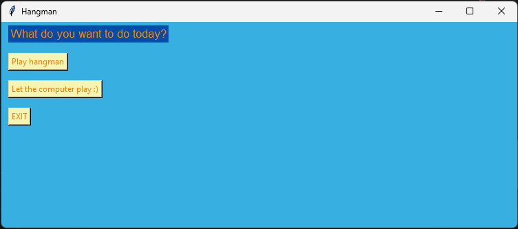

## User vs Computer

Word is godforsaken🤫

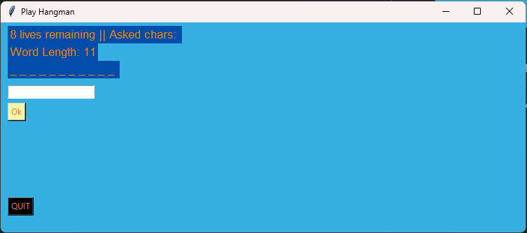
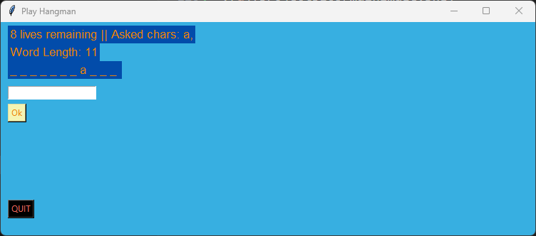
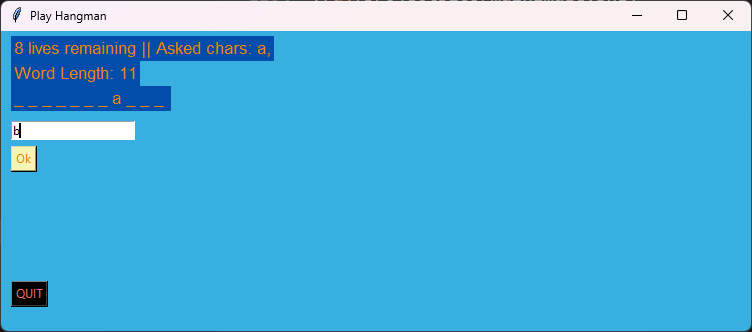
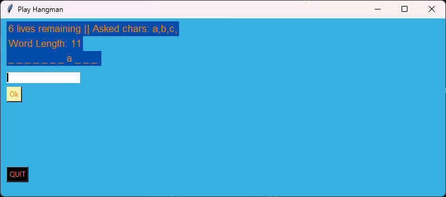
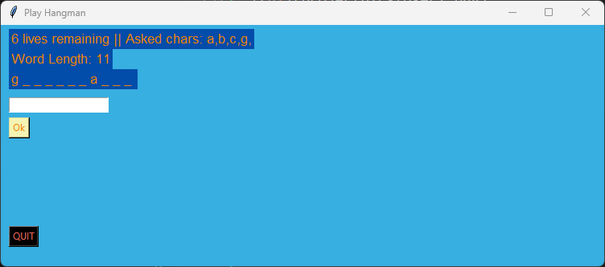
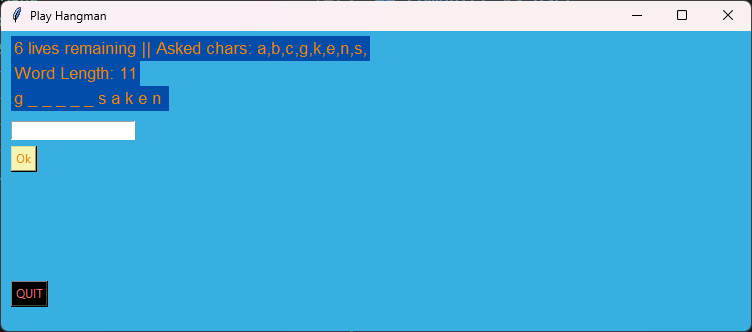
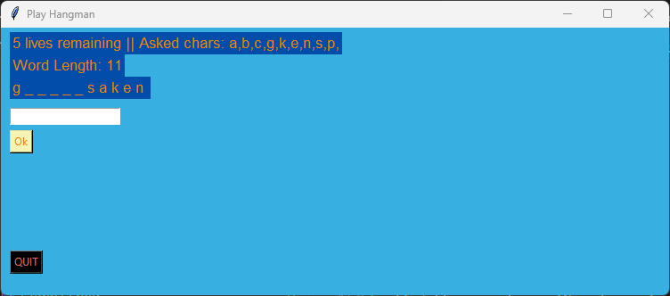
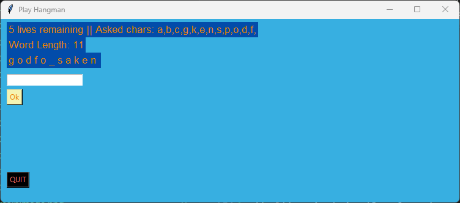
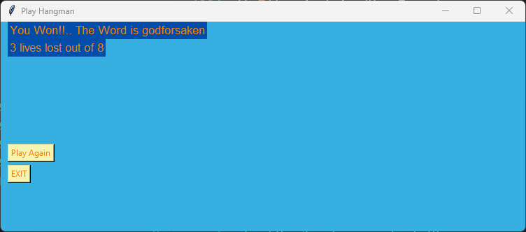

## Computer vs User

Word is abacus🤫


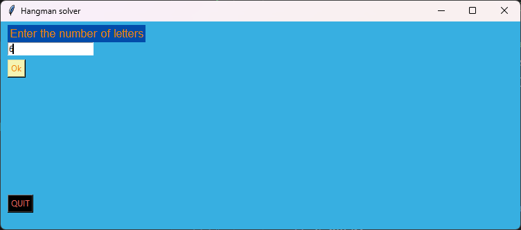
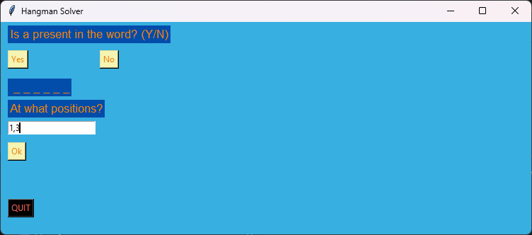

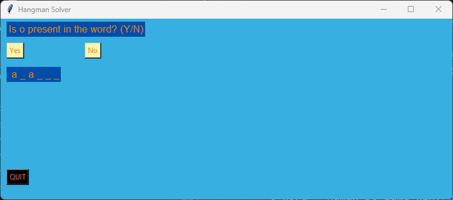

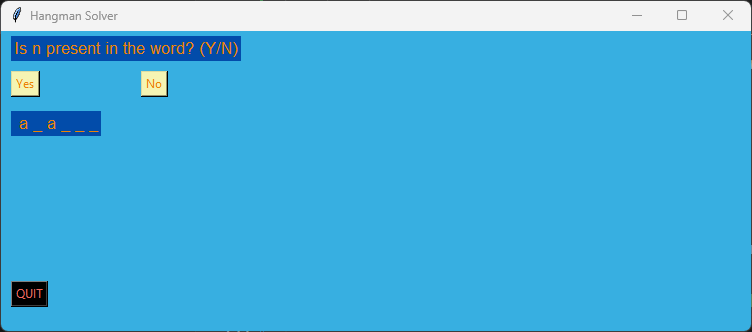

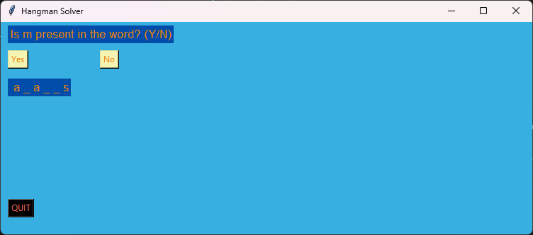


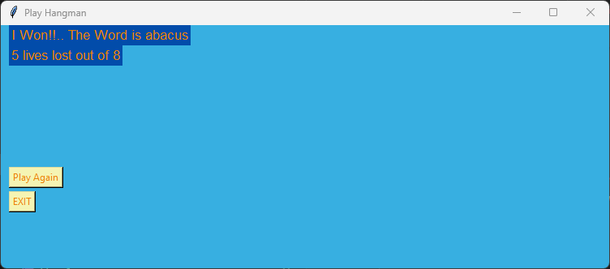